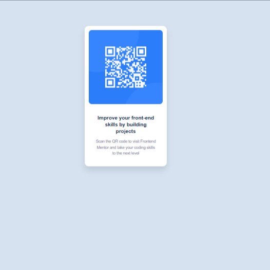
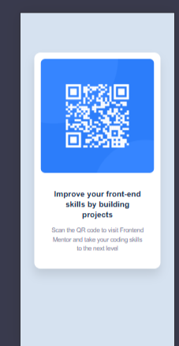

# Frontend Mentor - QR code component solution

This is my solution to the [QR code component challenge on Frontend Mentor] https://www.frontendmentor.io/solutions/qr-code-component-solution-_qV4qAXUlx. This challenge helped me strengthen my understanding of basic HTML and CSS layout techniques.

## Table of contents

- [Overview](#overview)
  - [Screenshot](#screenshot)
  - [Links](#links)
- [My process](#my-process)
  - [Built with](#built-with)
  - [What I learned](#what-i-learned)
  - [Continued development](#continued-development)
  - [Useful resources](#useful-resources)
- [Author](#author)

## Overview

### Screenshot




### Links

- **Solution URL**: https://www.frontendmentor.io/solutions/qr-code-component-solution-i2LrDmzdjc
- **Live Site URL**: https://qr-code-component-solution-frontend.netlify.app/

## My process

### Built with

- Semantic **HTML5**
- **CSS custom properties**
- **Flexbox** for layout
- **Mobile-first workflow**
- [Visual Studio Code](https://code.visualstudio.com/) as code editor

### What I learned

While building this project, I gained more confidence in:

- Centering elements vertically and horizontally using Flexbox
- Using `max-width` to control component width
- Creating reusable class structures
- Improving visual hierarchy with padding and border-radius

Here’s an example of the core layout I used:

```css
body {
  display: flex;
  justify-content: center;
  align-items: center;
  min-height: 100vh;
  background-color: hsl(212, 45%, 89%);
}

.card {
  background-color: hsl(0, 0%, 100%);
  padding: 1rem;
  border-radius: 1rem;
  max-width: 320px;
  text-align: center;
  box-shadow: 0 0 20px rgba(0, 0, 0, 0.05);
}


### Author
- Twitter – @Benjaminkissa1,

- Frontend Mentor – @Bensolve

