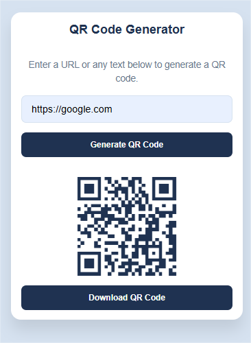

# Frontend Mentor - QR Code Component & Generator Solution

This repository contains two versions of the QR Code challenge from [Frontend Mentor](https://www.frontendmentor.io/challenges/qr-code-component-iux_sIO_H).  
The project started with a simple static component and has evolved into a fully functional QR Code Generator.

---

## 📑 Table of Contents

- [Overview](#overview)
  - [Screenshots](#screenshots)
  - [Links](#links)
- [My Process](#my-process)
  - [Built With](#built-with)
  - [What I Learned](#what-i-learned)
  - [Continued Development](#continued-development)
- [Author](#author)

---

## 🚀 Overview

### 🔳 Static QR Code Component (Main Branch)

This version replicates the Frontend Mentor design using clean, semantic HTML and CSS. It helped reinforce layout techniques and responsive design principles.

### ⚙️ Enhanced QR Code Generator (qr-generator Branch)

This version adds real-time QR generation from user input using JavaScript. It introduces a more interactive experience while maintaining a clean, mobile-first UI.

---

## 📸 Screenshots

**Static Version**


**Enhanced Generator**



---

## 🔗 Links

| Type                    | Link                                                                 |
|-------------------------|----------------------------------------------------------------------|
| 🧩 Challenge            | [Frontend Mentor Challenge](https://www.frontendmentor.io/solutions/qr-code-component-solution-i2LrDmzdjc) |
| 🌐 Live (Static)       | [View Static Site](https://qr-code-component-solution-frontend.netlify.app) |
| ⚙️ Live (Generator)    | [View QR Generator (Branch Deploy)](https://qr-generator--qr-code-component-solution-frontend.netlify.app) |

---

## 🛠️ My Process

### 🧱 Built With

- Semantic **HTML5**
- **CSS custom properties**
- **Flexbox** layout
- **Mobile-first** design
- **Vanilla JavaScript** (for generator logic)
- [Visual Studio Code](https://code.visualstudio.com/)

---

### 🎓 What I Learned

- How to center content using Flexbox and margin utilities
- Applying responsive units like `clamp()` and `max-width`
- Using BEM naming conventions for scalability
- Handling user input and DOM manipulation in JS
- Generating QR codes with [QRCode.js](https://davidshimjs.github.io/qrcodejs/)

Here’s a core layout snippet from the static version:

```css
.card {
  background-color: hsl(0, 0%, 100%);
  padding: 1rem;
  border-radius: 1rem;
  max-width: 320px;
  text-align: center;
  box-shadow: 0 0 20px rgba(0, 0, 0, 0.05);
}

### 🔮 Continued Development

Here are some enhancements I'm planning to add to improve user experience and functionality:

- 🔄 **Dynamic QR Code Input**  
  Users will be able to enter any text or URL to instantly generate a QR code.

- 💾 **Download QR Code as Image**  
  Add functionality to download the generated QR code as a PNG or SVG file for offline use.

- 🔍 **Live Preview of Encoded Data**  
  Show a live text preview beneath the QR code to confirm exactly what will be encoded.

- 🖼️ **QR Scanner from Uploaded Image** _(Optional Advanced)_  
  Implement a feature to allow users to upload a QR code image and decode its contents.

- 🌙 **Light/Dark Theme Switcher**  
  Provide a toggle to switch between light and dark themes for better accessibility and user preference.


### 👤 Author

- [Twitter – @Benjaminkissa1](https://twitter.com/Benjaminkissa1)  
- [Frontend Mentor – @Bensolve](https://www.frontendmentor.io/profile/Bensolve)
